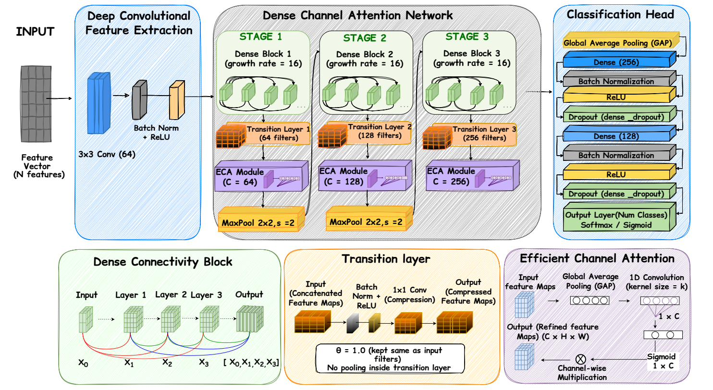

# MuDCANet IDS

**Mud Ring-Optimised Dense Convolutional Channel Attention Network for Network Intrusion Detection**

[](https://www.python.org/)
[](https://www.tensorflow.org/)
[](LICENSE)
[](#reproducibility)

MuDCANet is a deep learning framework for network intrusion detection that couples **dense connectivity** (feature reuse), **efficient channel attention** (feature selection), and **swarm-based hyperparameter optimisation** (the Mud Ring Algorithm) in a single end-to-end architecture — evaluated on **CICIDS2017** and **UNSW-NB15** under both binary and multiclass classification.

<p align="center">
  
  <br>
  MuDCANet architecture: deep convolutional feature extraction → three-stage Dense Channel Attention Network → classification head.
</p>

---
## Table of Contents

1. [Proposed Architecture](#proposed-architecture)
2. [Repository Layout](#repository-layout)
3. [Raw Data Files (Expected Paths)](#raw-data-files-expected-paths)
4. [Prerequisites](#prerequisites)
5. [Usage Workflow](#usage-workflow)
6. [Design Notes](#design-notes)
7. [Citations](#citations)

---

## Proposed Architecture

**MuDCANet** is composed of three stages, each realizing the pattern:

> **Dense Block → Transition Layer → ECA Block → MaxPool**

### Components

**Dense Block** : Every convolutional layer inside the block receives the concatenated outputs of *all* preceding layers in the block as input. Each internal layer follows the bottleneck structure *BN → ReLU → 1×1 Conv → BN → ReLU → 3×3 Conv*, with a growth rate of 16 feature maps per layer and 3 layers per block. 

**Transition Layer** : After each dense block the channel count has grown; the transition layer restores it to the stage's target filter count via *BN → ReLU → 1×1 Conv* and applies optional `SpatialDropout2D`.

**Efficient Channel Attention (ECA)** : A lightweight, parameter-free replacement for Squeeze-and-Excitation. ECA reweights channels using a single 1D convolution over the channel descriptor produced by Global Average Pooling (Wang et al., 2020).

**Classification Head** : Three-stage feature extractor is followed by Global Average Pooling and two fully-connected layers (`dense_units_1 = 256`, `dense_units_2 = 128`) with BatchNorm, ReLU, and Dropout.

**Hyperparameter Optimization** : MuDCANet's regularization and optimizer dynamics are tuned by the **Mud Ring Algorithm (MRA)** (Desuky et al., 2022). The 4-dimensional search space covers:

| Hyperparameter | Range | Scale |
|---|---|---|
| `conv_dropout` | [0.1, 0.4] | linear |
| `dense_dropout` | [0.2, 0.5] | linear |
| `learning_rate` | [1e-4, 1e-2] | log |
| `l2_reg` | [1e-5, 1e-3] | log |

Search runs **once** on fold 1 of the CICIDS2017 binary variant (8 dolphins × 5 iterations = 48 evaluations) and the best configuration is transferred to all four (dataset × task) variants.

---
## Repository Layout

```
MuDCCANet/
├── MuDCCANet.py                 # ★ Proposed model — DenseNet + ECA, MRA-tuned
├── ids_pipeline.py              # Two-phase pipeline: prepare folds + final splits, load
├── Preprocess.py                # CLI: clean raw CSVs → produce label-consolidated tables
│
├── baselines/
│   ├── ablation_base.py         # Shared training loop + save/plot helpers
│   │
│   ├── ablation_baselines/      # Component ablations (isolate each proposed piece)
│   │   ├── 2dcnn_base.py            #   plain Base CNN (no attention, no dense)
│   │   ├── DenseNet.py              #   Dense connections only, no attention
│   │   └── ECA-Net.py               #   ECA attention only, no dense
│   │
│   ├── attention_baselines/     # Alternative channel-attention mechanisms
│   │   ├── CBAM.py                  #   channel + spatial attention
│   │   └── SE.py                    #   Squeeze-and-Excitation
│   │
│   ├── connection_baselines/    # Alternative inter-layer connection schemes
│   │   ├── Highway_Net.py           #   Highway gated connections
│   │   └── ResNet.py                #   Residual skip connections
│   │
│   └── Optimization_baselines/  # Alternative swarm-intelligence tuners
│       ├── PSO.py                   #   Particle Swarm Optimization
│       ├── GWO.py                   #   Grey Wolf Optimizer
│       └── HHP.py                   #   Harris Hawks Optimization
│
├── docs/
│   └── architecture.png         # architecture diagram
├── requirements.txt
└── README.md
```

---

## Raw Data Files (Expected Paths)

Everything in the codebase is anchored at:

```
BASE = "/mnt/c/Users/Battosai Himura/Desktop/Projects/tf-gpu-env/ids"
```

Edit `BASE` at the top of `ids_pipeline.py` and the `DEFAULT_*_INPUT` constants at the top of `Preprocess.py` if your paths differ.

### Inputs — Raw Data

| Dataset | Expected Path | Notes |
|---|---|---|
| **UNSW-NB15** (raw) | `data/raw/raw_unsw-nb15/UNSW-NB15-full.csv"` | Single combined CSV of all UNSW-NB15 records with feature columns + `label` (binary) + `attack_cat` (multiclass). |
| **CIC-IDS2017** (raw) | `data/raw/raw_cicids2017/*.csv` | Folder containing the per-day CSVs. `Preprocess.py` combines them, so the exact filenames don't matter as long as they're all in this folder. |

### Outputs — Generated by the Pipeline

| Path | Written by | Contents |
|---|---|---|
| `data/preprocessed/unsw-nb15_preprocessed.csv` | `Preprocess.py` | Cleaned UNSW (nulls/dupes removed, one-hot encoded, rare classes dropped). |
| `data/preprocessed/cicids_preprocessed.csv` | `Preprocess.py` | Cleaned CICIDS (nulls/inf/dupes removed, attack classes consolidated, Infiltration dropped). |
| `data/processed/pipeline_cache/cicids_clean_cap*.parquet` | `ids_pipeline.py` | Cached shrunk CICIDS (majority classes randomly capped for tractability). |
| `data/processed/processed_data/{ds}_{task}/final/` | `ids_pipeline.py` | Precomputed 80% train (SMOTE-Tomek + MinMax) + untouched (scaled) test set. |
| `data/processed/processed_data/{ds}_{task}/folds/fold_{1..5}/` | `ids_pipeline.py` | Precomputed CV folds — each fold's train partition SMOTE-Tomek'd + scaled, val partition scaled only. |
| `data/processed/resample_logs/{ds}_{task}_counts.json` | `ids_pipeline.py` | Pre/post-resample class distributions. |
| `experiment_results/{script}/` | `<training scripts>` | Trained model checkpoints, `.npy` arrays, JSON histories, CV metrics CSVs, master summaries, confusion matrices, ROC curves. |

---

## Prerequisites

- Python 3.10+
- TensorFlow 2.x with GPU support (all experiments assume CUDA is available)

Install everything with:

```bash
pip install -r requirements.txt
```

---

## Usage Workflow

The pipeline is **strictly sequential** — later steps assume earlier ones have completed successfully. Run all commands from the repository root.

### Step 1 — Clean the raw data (once)

```
python Preprocess.py --dataset both
```

Options: `--dataset {unsw,cicids,both}`, `--no-visuals`, `--force` (overwrite existing).

Produces the two cleaned CSVs listed in the `data\preprocessed` table above, plus stage-1 and stage-2 EDA plots per dataset.

### Step 2 — Precompute all folds + final splits (once)

```
python ids_pipeline.py
```

For each of the 4 (dataset × task) variants, this performs:

- 80/20 stratified train/test split on the cleaned data (no scaling, no resampling).
- For each of 5 CV folds:
  - `SMOTE-Tomek` on the fold's train partition only → `MinMaxScaler` on the resampled data → save.
  - Fold val partition is scaled with the same fold scaler (no resampling) → save.
- For the final training run:
  - `SMOTE-Tomek` on the entire 80% train partition → `MinMaxScaler` on the resampled data → save.
  - Test partition (20%) is scaled with the final scaler → save (untouched, no resampling).

Saves 24 fold datasets + 4 final datasets to disk. All subsequent training scripts load precomputed arrays and never resample anything at run time.

### Step 3 — Train the proposed model

```bash
python MuDCCANet.py
```

Runs MudRing search on CICIDS binary (fold 1), then trains and evaluates the transferred configuration on all four (CICIDS × {binary, multiclass}, UNSW × {binary, multiclass}) variants.

### Step 4 — Run ablation and comparison experiments

```
# Component ablations (all 4 variants each)
python baselines/ablation_baselines/2dcnn_base.py
python baselines/ablation_baselines/DenseNet.py
python baselines/ablation_baselines/ECA-Net.py

# Alternative attention mechanisms (all 4 variants each)
python baselines/attention_baselines/SE.py
python baselines/attention_baselines/CBAM.py

# Alternative connection mechanisms (all 4 variants each)
python baselines/connection_baselines/ResNet.py
python baselines/connection_baselines/Highway_Net.py

# Alternative swarm optimizers (binary tasks only)
python baselines/optimization_baselines/PSO.py
python baselines/optimization_baselines/GWO.py
python baselines/optimization_baselines/HHP.py
```

Each script writes per-variant summary CSVs plus a master CSV under its own `outputs/experiment_results/{name}/` folder.

---

## Design Notes

### Leakage-free training

`SMOTE-Tomek` and `MinMaxScaler` are fit exclusively on training partitions (per-fold and on the final 80% train) and applied as transforms to the corresponding val/test data. The 20% held-out test partition is never resampled, and any classifier evaluation on it reports honest generalization performance.

### Precomputation

`SMOTE-Tomek` is computationally expensive. The precomputation step runs it 24 times total (4 variants × 6 splits: 5 folds + 1 final) and caches the results to disk. Every training script loads these precomputed arrays instead of recomputing, converting hundreds of redundant resampling operations into 24.

### Balancing strategy

- **CIC-IDS2017 (binary + multiclass)**: full balance — all classes resampled to the majority count.
- **UNSW-NB15 binary**: full balance.
- **UNSW-NB15 multiclass**: partial balance — the majority (Normal) is capped at 200,000 and minorities are resampled up to 100,000 (50% ratio). Full equalization would require excessive synthetic inflation for very rare classes (Analysis, Backdoor), so the partial scheme preserves data character while mitigating imbalance.

### Reproducibility

All splits, folds, resampling, and initialization use `seed=42`. Rerunning the pipeline produces byte-identical `.npy` files (subject to library-version consistency).

---

## Citation

If you use MuDCANet in your research, please cite:

```bibtex
@article{<key>,
  title   = {MuDCANet: An Integrated Deep Learning Model for Network Intrusion 
            Detection in Modern Networks Using Convolutional Neural Networks},
  author  = {<Authors>},
  journal = {<Journal>},
  year    = {<Year>},
  doi     = {<DOI>}
}
```
### References

- Huang, G., Liu, Z., Van Der Maaten, L., & Weinberger, K. Q. (2017). *Densely connected convolutional networks*. In **CVPR**, pp. 4700–4708.
- Wang, Q., Wu, B., Zhu, P., Li, P., Zuo, W., & Hu, Q. (2020). *ECA-Net: Efficient channel attention for deep convolutional neural networks*. In **CVPR**, pp. 11534–11542.
- Hu, J., Shen, L., & Sun, G. (2018). *Squeeze-and-excitation networks*. In **CVPR**, pp. 7132–7141.
- Woo, S., Park, J., Lee, J. Y., & Kweon, I. S. (2018). *CBAM: Convolutional block attention module*. In **ECCV**, pp. 3–19.
- He, K., Zhang, X., Ren, S., & Sun, J. (2016). *Deep residual learning for image recognition*. In **CVPR**, pp. 770–778.
- Srivastava, R. K., Greff, K., & Schmidhuber, J. (2015). *Training very deep networks*. In **NeurIPS**.
- Desuky, A. S., Cifci, M. A., Kausar, S., Hussain, S., & El Bakrawy, L. M. (2022). *Mud Ring Algorithm: a new meta-heuristic optimization algorithm for solving mathematical and       engineering challenges*. **IEEE Access**, Vol. 10, pp. 50448–50466.
- Heidari, A. A., Mirjalili, S., Faris, H., Aljarah, I., Mafarja, M., & Chen, H. (2019). *Harris hawks optimization: Algorithm and applications*. **Future Generation Computer Systems**, 97, 849–872.
- Kennedy, J., & Eberhart, R. (1995). *Particle swarm optimization*. In **ICNN**, pp. 1942–1948.
- Mirjalili, S., Mirjalili, S. M., & Lewis, A. (2014). *Grey wolf optimizer*. **Advances in Engineering Software**, 69, 46–61.

### Datasets

- **CIC-IDS2017**: Sharafaldin, I., Lashkari, A. H., & Ghorbani, A. A. (2018). *Toward generating a new intrusion detection dataset and intrusion traffic characterization*. In **ICISSP**.
- **UNSW-NB15**: Moustafa, N., & Slay, J. (2015). *UNSW-NB15: a comprehensive data set for network intrusion detection systems*. In **MilCIS**.